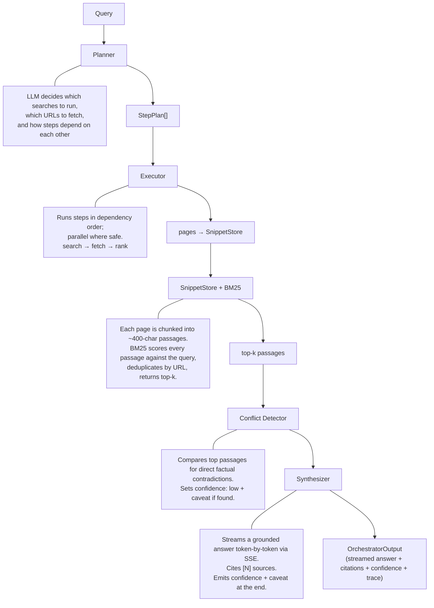

# LLM Orchestrator

A TypeScript LLM-powered research orchestrator. Give it a natural language query - it plans a retrieval strategy, searches and fetches public web sources, ranks passages by relevance, checks for source conflicts, and streams a grounded cited answer back to you.

---

## Architecture



**Key design principles:**

- **Separation of concerns** - Planner, Executor, SnippetStore, ConflictDetector, and Synthesizer are independent modules with clear interfaces.
- **Dependency-aware parallelism** - The executor runs all dependency-free steps concurrently; steps that depend on others wait.
- **Graceful degradation** - If the LLM planner fails, a hardcoded fallback plan is used. If individual fetch/search steps fail, downstream steps are skipped rather than crashing.
- **BM25 over passages** - Fetched pages are split into overlapping ~400-char passages before storage. BM25 (with term saturation and length normalisation) ranks passages rather than full pages, then deduplicates by URL before passing top-k to the synthesizer.
- **Conflict detection** - Before synthesis, the top passages are checked for direct factual contradictions. Conflicts are surfaced as a caveat and lower the confidence rating.
- **Streaming synthesis** - The synthesizer streams tokens from MiniMax via SSE so the answer types out in the browser in real time.
- **Grounded outputs only** - The synthesizer is instructed never to invent facts. Confidence levels (`high` / `medium` / `low` / `insufficient`) reflect source quality, not just presence.

---

## Requirements

- Node.js 18+
- [MiniMax API key](https://platform.minimax.io/user-center/basic-information/interface-key)
- [Serper API key](https://serper.dev) 

---

## Setup

```bash
git clone https://github.com/chirayupatel9/llm-orchestrator.git
cd llm-orchestrator
npm install
cp .env.example .env
# Edit .env and fill in both API keys
```

---

## Environment variables

| Variable | Required | Default | Description |
|---|---|---|---|
| `MINIMAX_API_KEY` | **Yes** | - | MiniMax API key |
| `SERPER_API_KEY` | **Yes** | - | Serper API key (Google search) |
| `LLM_MODEL` | No | `MiniMax-Text-01` | Any MiniMax model string |

---

## Running

### Browser UI

```bash
npm run serve
```

Opens `http://localhost:3000` automatically. The interface has two panels:

- **Left** - answer streams in token by token as MiniMax responds, then citations appear below
- **Right** - live execution trace showing each step as it runs, with type, description, and duration

Custom port:
```bash
npm run query -- --serve 4000
```

### CLI

```bash
npm run query -- "your question here"
```

With spinners:
```bash
npm run query -- "your question here" --verbose
```

**Flags:**

| Flag | Default | Description |
|---|---|---|
| `--verbose` / `-v` | off | Animated per-step spinners in terminal |
| `--serve [port]` | - | Launch browser UI (default port 3000) |
| `--top-k <n>` / `-k <n>` | `5` | Passages passed to synthesizer |
| `--json` | off | Output raw JSON instead of formatted text |
| `--no-trace` | off | Omit trace summary from CLI output |

---

## Example

```bash
npm run query -- "What are the main differences between RAG and fine-tuning for LLMs?" --verbose
```

### CLI output shape

```
PS Z:\code\llm-orchestrator> npm run query -- "What are the main differences between RAG and fine-tuning for LLMs?" --verbose
npm verbose cli C:\Program Files\nodejs\node.exe C:\Users\Chirayu Patel\AppData\Roaming\npm\node_modules\npm\bin\npm-cli.js
npm info using npm@11.4.2
npm info using node@v22.15.0
npm verbose title npm run query What are the main differences between RAG and fine-tuning for LLMs?
npm verbose argv "run" "query" "What are the main differences between RAG and fine-tuning for LLMs?" "--loglevel" "verbose"
npm verbose logfile logs-max:10 dir:C:\Users\Chirayu Patel\AppData\Local\npm-cache\_logs\2026-04-20T15_08_11_937Z-
npm verbose logfile C:\Users\Chirayu Patel\AppData\Local\npm-cache\_logs\2026-04-20T15_08_11_937Z-debug-0.log

> llm-orchestrator@1.0.0 query
> tsx src/index.ts What are the main differences between RAG and fine-tuning for LLMs?


Answer
Query: What are the main differences between RAG and fine-tuning for LLMs?
Confidence: HIGH
⚠  The information provided is based on the snippets and may not cover all possible aspects of RAG and fine-tuning.

Retrieval-Augmented Generation (RAG) and fine-tuning are two distinct approaches to enhancing the performance of large language models (LLMs), each with its own methodology and use cases.

RAG is a technique that enhances the accuracy and reliability of LLMs by allowing them to retrieve and incorporate information from external, authoritative data sources in real-time before generating a response [2][4][5]. This method leverages an organization's proprietary databases or other knowledge bases to provide the model with the most current and relevant information, without the need for retraining [2]. RAG is particularly useful for improving the model's ability to provide up-to-date and accurate information, reducing the likelihood of hallucinations, and increasing user trust by allowing users to verify the sources of the information used in the response [4][5].

On the other hand, fine-tuning involves continuing the training of a pre-trained LLM on a targeted dataset to improve its performance on a specific task or within a particular domain [3]. This approach builds on the model's existing knowledge and is used to adapt a general-purpose LLM to specialized use cases such as customer service, medical diagnosis, or legal analysis [3]. Fine-tuning requires a significant amount of computational resources and time, as it involves retraining the model on a new dataset [3]. However, it allows for a deeper level of customization and can lead to significant improvements in the model's performance for the specific task or domain it is fine-tuned for [3].

In summary, RAG is a cost-effective and efficient method for enhancing LLM performance by providing access to external, authoritative data sources without the need for retraining, while fine-tuning involves retraining the model on a specific dataset to improve its performance on a particular task or domain. RAG is ideal for scenarios where up-to-date and accurate information is crucial, whereas fine-tuning is more suitable for adapting a model to specific tasks or domains where the training data is available and relevant [1][2][3][4][5].

Sources
  [1] RAG vs. Fine-tuning | IBM
      https://www.ibm.com/think/topics/rag-vs-fine-tuning
      relevance: 4.882
  [2] What is RAG? - Retrieval-Augmented Generation AI Explained - AWS
      https://aws.amazon.com/what-is/retrieval-augmented-generation/
      relevance: 2.014
  [3] Fine-tuning large language models (LLMs) in 2026 | SuperAnnotate
      https://www.superannotate.com/blog/llm-fine-tuning
      relevance: 1.925
  [4] Retrieval-augmented generation - Wikipedia
      https://en.wikipedia.org/wiki/Retrieval-augmented_generation
      relevance: 1.666
  [5] What Is Retrieval-Augmented Generation aka RAG | NVIDIA Blogs
      https://blogs.nvidia.com/blog/what-is-retrieval-augmented-generation/
      relevance: 1.367

npm verbose cwd Z:\code\llm-orchestrator
npm verbose os Windows_NT 10.0.26200
npm verbose node v22.15.0
npm verbose npm  v11.4.2
npm verbose exit 0
npm info ok
```


### Confidence levels

| Level | Meaning |
|---|---|
| `high` | Multiple sources agree with strong direct evidence |
| `medium` | Sources found and relevant, but coverage is partial or sources are secondary |
| `low` | Conflicting sources detected - caveat field explains the contradiction |
| `insufficient` | No usable sources retrieved |

---

## Reliability and failure handling

| Scenario | Behaviour |
|---|---|
| LLM planner returns invalid JSON | Falls back to a hardcoded search→fetch→rank→synthesize plan |
| A fetch URL times out or returns non-HTML | Logged in trace; passage skipped; other URLs continue |
| A search returns 0 results | Downstream fetch steps receive an empty list; trace records it |
| No snippets retrieved at all | Synthesizer returns `confidence: "insufficient"` with explanation |
| Conflicting sources detected | `confidence: "low"`, caveat names the specific contradiction |
| Conflict detection LLM call fails | Silently skipped; synthesis proceeds without conflict info |
| `MINIMAX_API_KEY` or `SERPER_API_KEY` not set | Clear error at startup, exits with code 1 |

---

## Project structure

```
src/
  index.ts                  # CLI entry point (Commander)
  types.ts                  # Shared TypeScript interfaces
  orchestrator/
    index.ts                # Top-level orchestrate() - plan → execute → rank → check → synthesize
    planner.ts              # LLM-driven step planner with fallback
    executor.ts             # Dependency-aware parallel step executor
    synthesizer.ts          # Streaming LLM synthesis with citations + confidence
  retrieval/
    store.ts                # SnippetStore - passage chunking + BM25 ranking
    conflict.ts             # Conflict detector - LLM-based factual contradiction check
  tools/
    search.ts               # Serper API (Google results)
    fetch.ts                # Web page fetcher + content cleaner
  trace/
    collector.ts            # TraceCollector + CLI pretty-printer
  utils/
    llm.ts                  # MiniMax client - llmComplete() + llmStream()
    format.ts               # Terminal output formatter
    spinner.ts              # TTY spinner (no deps)
    cli-progress.ts         # Subscribes to progressBus → drives terminal spinners
    progress.ts             # Singleton progress event bus (CLI + SSE + streaming)
  server/
    index.ts                # Express server + SSE /query endpoint
ui/
  index.html                # Single-file browser UI with live streaming answer
```